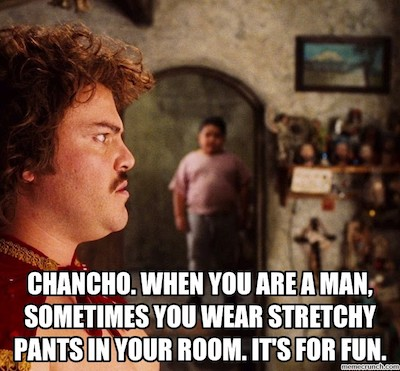

# node-bully

A fun demo of the bully algorithm (leader election) implemented in node.js  
more about the algorithm: https://en.wikipedia.org/wiki/Bully_algorithm

### prerequisites
* have node.js v6.9.1 or greater installed
* clone this git repository

### run demo  
<code>node demo</code>  
you can also add number of nodes, defaults to 5: <code>node demo 7</code>

### demo structure
**./lib/node.js**  *this is the bully algorithm implementation (as a lib)*  
**./wrapper/http.js** *this wrapper lets a node communicate over http (simulating a service using the lib)*  
**./demo.js** *this scripts runs the demo*

### demo explained
* first we will bring up X number of nodes in http services (fork child process)
* then we introduce the nodes to each other (the nodes will now elect a leader)
* we wait for a while and then we kill the current leader (the nodes will now elect a new leader)
* we wait for a while again and then bring the old leader back online (the initial leader will now be re-elected)
* we wait for a while yet again and then let a rogue node claim leadership (the nodes will re-elect the current leader)

### why this demo?

### License

Released under the MIT license. Copyright (c) 2016 Johan Hellgren.

Permission is hereby granted, free of charge, to any person obtaining a copy of this software and associated documentation files (the "Software"), to deal in the Software without restriction, including without limitation the rights to use, copy, modify, merge, publish, distribute, sublicense, and/or sell copies of the Software, and to permit persons to whom the Software is furnished to do so, subject to the following conditions:

The above copyright notice and this permission notice shall be included in all copies or substantial portions of the Software.

THE SOFTWARE IS PROVIDED "AS IS", WITHOUT WARRANTY OF ANY KIND, EXPRESS OR IMPLIED, INCLUDING BUT NOT LIMITED TO THE WARRANTIES OF MERCHANTABILITY, FITNESS FOR A PARTICULAR PURPOSE AND NONINFRINGEMENT. IN NO EVENT SHALL THE AUTHORS OR COPYRIGHT HOLDERS BE LIABLE FOR ANY CLAIM, DAMAGES OR OTHER LIABILITY, WHETHER IN AN ACTION OF CONTRACT, TORT OR OTHERWISE, ARISING FROM, OUT OF OR IN CONNECTION WITH THE SOFTWARE OR THE USE OR OTHER DEALINGS IN THE SOFTWARE.
